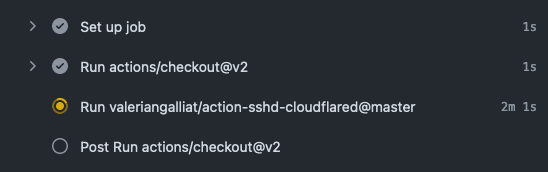

# 👩‍💻 action-sshd-cloudflared

> [GitHub Action] to debug via SSH over a [Cloudflare Tunnel].

[GitHub Action]: https://github.com/features/actions
[Cloudflare Tunnel]: https://developers.cloudflare.com/cloudflare-one/connections/connect-apps/

## Overview

This GitHub Action starts an ad hoc SSH server (inspired by
[`sshd` on the go](https://github.com/valeriangalliat/sshd-on-the-go)),
and creates a [Cloudflare Tunnel] to expose it (because we can't
directly open ports on a public IP address from the runner VM).

Then by using the `cloudflared` command you can bind that tunnel to a
local port and SSH there.

It's similar to the [debugging with
SSH](https://github.com/marketplace/actions/debugging-with-ssh) action
([action-upterm](https://github.com/lhotari/action-upterm)), but instead
of using [Upterm](https://upterm.dev/), it's simply backed by
`/usr/sbin/sshd`, `cloudflared` and [100 lines of commented shell script](setup-ssh).

The main difference is that the community `uptermd` server on
`uptermd.upterm.dev` (the default if you don't specify your own server)
technically has full visibility on your unencrypted SSH traffic,
whereas thanks to `cloudflared` allowing to [tunnel raw TCP traffic](https://developers.cloudflare.com/cloudflare-one/applications/non-http/arbitrary-tcp/),
action-sshd-cloudflared is end-to-end encrypted.

## Usage

```yaml
name: CI
on:
  - push
jobs:
  build:
    runs-on: ubuntu-latest
    steps:
      - uses: actions/checkout@v2
      - uses: valeriangalliat/action-sshd-cloudflared@v2
```

Example output:

```
Downloading `cloudflared` from <https://github.com/cloudflare/cloudflared/releases/latest/download/cloudflared-linux-amd64>...
Configured SSH key(s) for user: valeriangalliat
Creating SSH server key...
Creating SSH server config...
Starting SSH server...
Starting tmux session...
Starting Cloudflare tunnel...

Run the following command to connect:

    ssh-keygen -R action-sshd-cloudflared && echo 'action-sshd-cloudflared ssh-rsa (public key goes here)' >> ~/.ssh/known_hosts && ssh -o ProxyCommand='cloudflared access tcp --hostname https://recycling-currently-enjoy-pregnant.trycloudflare.com' runner@action-sshd-cloudflared

What the one-liner does:

    # Remove old SSH server public key for `action-sshd-cloudflared`
    ssh-keygen -R action-sshd-cloudflared

    # Trust the public key for this session
    echo 'action-sshd-cloudflared ssh-rsa (public key goes here)' >> ~/.ssh/known_hosts

    # Connect using `cloudflared` as a transport (SSH is end-to-end encrpted over this tunnel)
    ssh -o ProxyCommand='cloudflared access tcp --hostname https://recycling-currently-enjoy-pregnant.trycloudflare.com' runner@action-sshd-cloudflared

    # Alternative if you don't want to verify the host key
    ssh -o ProxyCommand='cloudflared access tcp --hostname https://recycling-currently-enjoy-pregnant.trycloudflare.com' -o UserKnownHostsFile=/dev/null -o StrictHostKeyChecking=accept-new runner@action-sshd-cloudflared
```

You can download `cloudflared` from
[here](https://developers.cloudflare.com/cloudflare-one/connections/connect-apps/install-and-setup/installation/)
or [here](https://github.com/cloudflare/cloudflared/releases).

When logging in, you'll be automatically attached to a tmux session.
Whenever you exit the session, the action will stop the tunnel and SSH
server and continue its steps.

## Getting SSH connection string via [ix.io](http://ix.io)

If you invoke this action via `dispatch_workflow`, you have no chance to
get the SSH connection from GitHub user interface. This is annoying, and
the solution for it is easy: to use a pastebin service like [ix.io](http://ix.io).

Why IX?

* It is free
* It supports creating named users with password on-the-fly, and
  provides the per-user paste list available at `http://ix.io/user/<USERNAME>`
* All interactions can be done via simple `curl` requests

To get SSH connection string via IX, first generate random (or
meaningful) user name and password and add them as `IX_USERNAME` and
`IX_PASSWORD` GitHub project secrets. Next, add the environment
variables to the action YAML file as follows:

```yaml
name: CI
on:
  - push
jobs:
  build:
    runs-on: ubuntu-latest
    steps:
      - uses: actions/checkout@v2
      - uses: valeriangalliat/action-sshd-cloudflared@v2
        env:
          - IX_USERNAME: ${{ secrets.IX_USERNAME }}
          - IX_PASSWORD: ${{ secrets.IX_PASSWORD }}
```

When workflow is started, navigate to `http://ix.io/user/<IX_USERNAME>` and
grab your SSH connection details!

Please note the paste is automatically deleted on workflow completion.

## More details

If you want to know everything about this program, you can read the
detailed blog posts I wrote about the
[client](https://www.codejam.info/2022/05/debugging-github-actions-workflow-ssh.html)
and
[server](https://www.codejam.info/2022/05/github-action-expose-ssh-server.html)
parts of action-sshd-cloudflared. Enjoy!

## Troubleshooting

### GitHub Action hangs without logs

All you see in your workflow output is the SSH step running but you
can't expand the live logs.



This is quite annoying because the logs is where we output the host to
connect to. 😬

This is a recurring bug with GitHub Actions: if you open the action logs
page after the step started running, it won't be able to show logs until
the command completes. Or if you're lucky it will show logs from the
moment you "joined", but that might not include the part you want to see
like the SSH host.

This is more likely to happen if this is one of the first actions in
your workflow.

The preferred solution for such behavior is to use IX notification (see
above), but if you don't want to go with external services, please read
the old workarounds below:

At that point you need to cancel the action and restart it, making sure
to open the logs right away, and reload the page aggressively in the
beginning before a runner was found, e.g. when you see this:

```
Waiting for a runner to pick up this job...
Job is waiting for a hosted runner to come online.
```

If you want to add a bit of a delay to get a chance to catch the logs in
time, you can add the following in your `steps`:

```yaml
      - run: sleep 5
```
